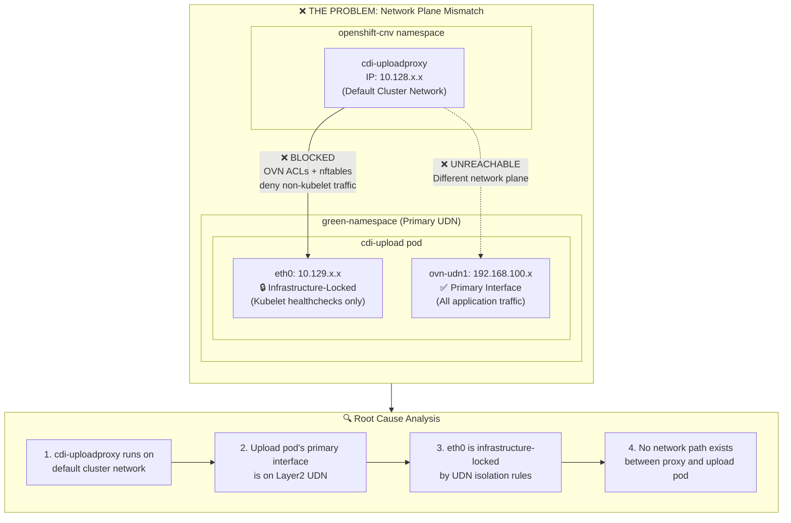
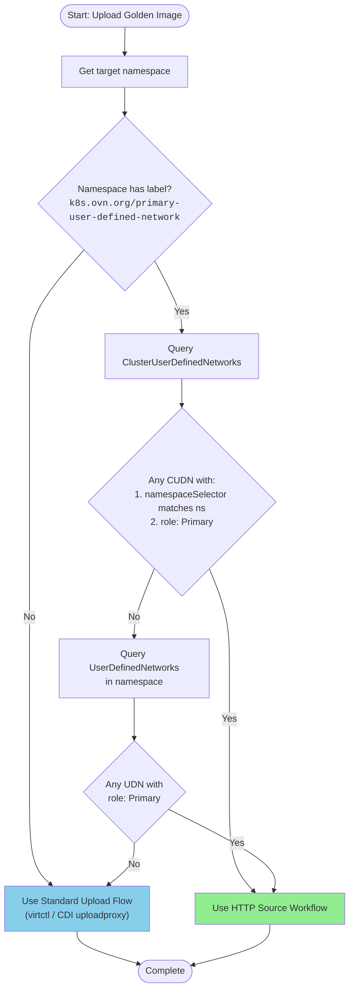
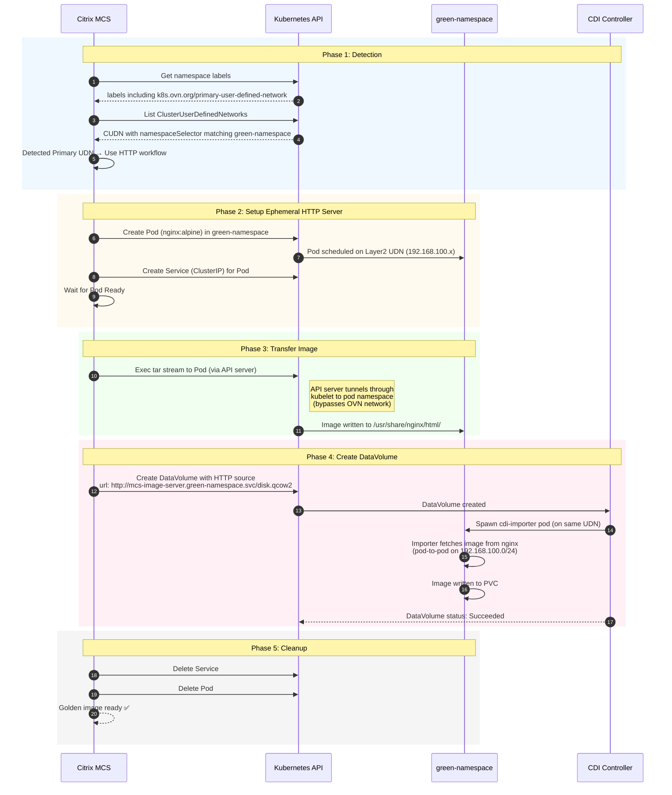
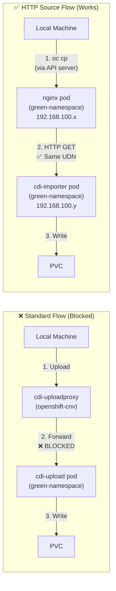
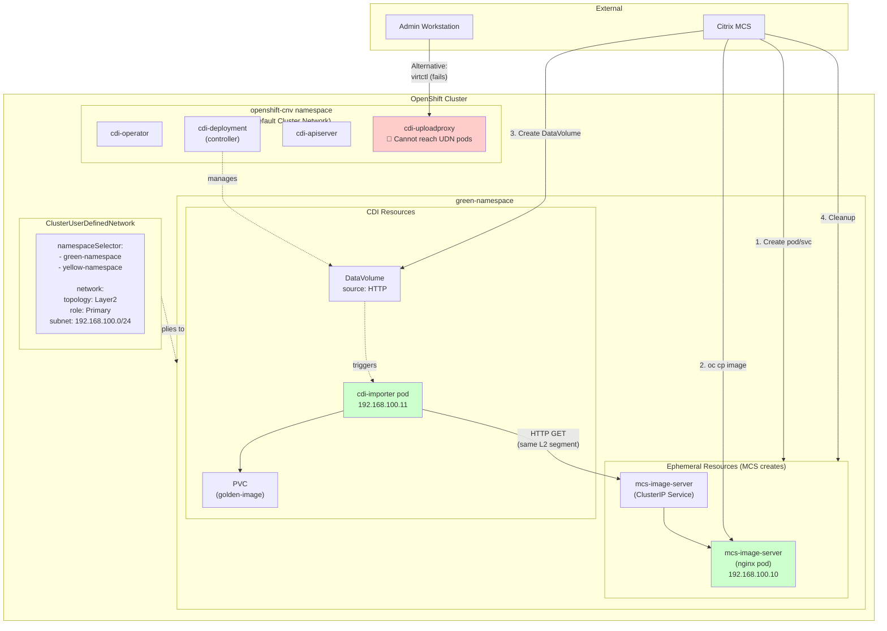
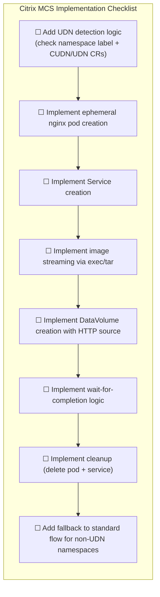

# Golden Image Upload with Primary User-Defined Networks

## Why Standard Upload Workflows Fail



## UDN Detection Logic



## HTTP Source Workflow (Recommended Solution)



## Network Flow Comparison



## Component Architecture



## Decision Matrix

```mermaid
quadrantChart
    title Upload Method Selection
    x-axis Low Complexity --> High Complexity
    y-axis Requires External Infra --> Self-Contained
    quadrant-1 Avoid if possible
    quadrant-2 Best for UDN namespaces
    quadrant-3 Best for standard namespaces
    quadrant-4 Consider for CI/CD pipelines
    
    HTTP Source (ephemeral server): [0.25, 0.85]
    Standard Upload (virtctl): [0.2, 0.15]
    Registry Source: [0.6, 0.3]
    S3 Source: [0.7, 0.25]
    Port-Forward (manual): [0.5, 0.7]
```

## Implementation Checklist



## Summary

| Scenario | Method | Works with UDN? |
|----------|--------|-----------------|
| Standard namespace | `virtctl image-upload` / CDI uploadproxy | ✅ Yes |
| Primary UDN namespace | `virtctl image-upload` / CDI uploadproxy | ❌ No |
| Primary UDN namespace | HTTP source with ephemeral server | ✅ Yes |
| Primary UDN namespace | Registry source | ✅ Yes (requires registry) |
| Primary UDN namespace | S3 source | ✅ Yes (requires S3) |
